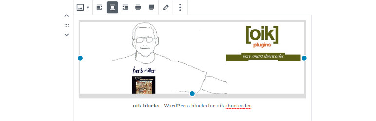

# oik-blocks 

* Contributors: bobbingwide
* Donate link: https://www.oik-plugins.com/oik/oik-donate/
* Tags: gutenberg, shortcode, blocks, oik
* Requires at least: 5.5.1
* Tested up to: 6.3.1
* Gutenberg compatible: Yes
* Stable tag: 1.4.3
* License: GPLv3 or later
* License URI: https://www.gnu.org/licenses/gpl-2.0.html

## Description 
WordPress blocks, aka Gutenberg blocks, for oik shortcodes.

The blocks in this plugin are a mixture of
- prototype blocks to replace oik-shortcodes
- and blocks to help document WordPress blocks.

oik-blocks provides 6 blocks

- Block icon
- Block info
- Block list
- Fields
- Nivo slider
- Person

v0.6.0 delivered other blocks. Each of these blocks have been implemented in other plugins
so have been deleted from this plugin.

- Address
- Contact form
- Countdown
- CSS
- CSV
- Dash icon
- Dynamic content
- Follow me
- GeSHi
- GitHub Issue
- Google Maps
- Search
- Prototype Generic shortcode block (undocumented on oik-plugins.com )
- UK tides
- WordPress version

For more info on the blocks included in the plugin see:

[blocks readme](https://github.com/bobbingwide/oik-blocks/tree/master/src)

## Installation 
1. Upload the contents of the oik-blocks plugin to the `/wp-content/plugins/oik-blocks' directory
1. Activate the oik-blocks plugin through the 'Plugins' menu in WordPress

## Frequently Asked Questions 

Where can I find out more?

https://github.com/bobbingwide/oik-blocks/

Yes, it uses a number of other plugins:

- oik
- oik-fields
- Gutenberg and / or WordPress 5.0 or above
- oik-nivo-slider
- oik-user

## Screenshots 
1. to be completed

## Upgrade Notice 
# 1.4.3 
Upgrade for PHP 8.2 support.

## Changelog 
# 1.4.3 
* Changed: Build with wp-scripts v26.12.0 #47
* Changed: Support PHP 8.2 #63
* Changed: Block list: Add filterVariations function #54
* Tested: With WordPress 6.3.1 and WordPress Multisite
* Tested: With Gutenberg 16.6.0
* Tested: With PHP 8.2

## Further reading 
If you want to read more about the oik plugins then please visit the
[oik plugin](https://www.oik-plugins.com/oik)
**"the oik plugin - for often included key-information"**

